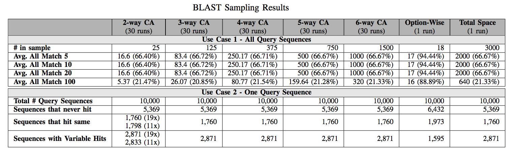

## BLAST subject

We use the command line version BLAST Version 2.6.0.  BLAST includes many sub-applications, we use Nucleotide BLAST (or blastn).  

Our input sequence is the yeast organism _Saccharomyces cerevisiae_ also known as _Baker's yeast_.  This file is **yeast.nt.fasta_20000**.
We restrict the search database to the yeast organism.  Those files are **yeast.GCF.nhr**, **yeast.GCF.nin**, and **yeast.GCF.nsq**.
The general command we run is ```blastn -db /tmp/yeast.GCF -query /tmp/yeast.nt.fasta_20000 -outfmt 6 -evalue 1e-300 -perc_identity 100```.

The configuration options we explore in our study are added to the command:
* -dust <String>
* -soft_masking <Boolean>
* -lcase_masking <Flag>
* -xdrop_ungap <Real>
* -sdrop_gap <Real>
* -xdrop_gap_final <Real>
* -ungapped <Flag>

## Complete Configuration Model


## Sampling Results
We ran 30 CIT samples from strength 2 to 6.  We present the average number of tests that match the deafult value accross the 30 runs.  We also take the percentage (number that match / total number in sample) in order to normalize it.  This gives us the data in top portion of the table for Use Case (1).  We can see here that the percentage of hits matching the default is consistent over all the samples.  This tells us sampling maintains the _same proportion of variability_ as the total configuration space (unlike the MEGAHIT subject).  For Use Case (2) we see some variability in the results of the 2-way CA, but they number of sequences without any hits remaining the same.  This tells us that if a query has a hit in the database, we can find it with only 25 configurations.



