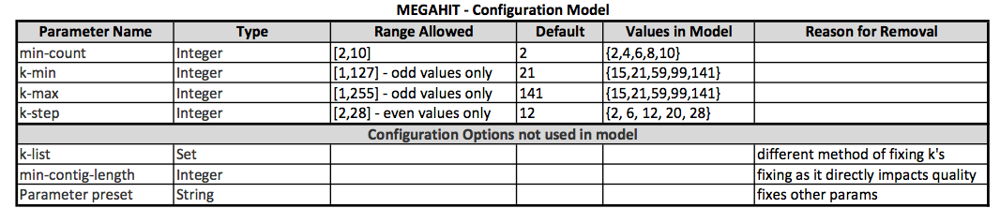
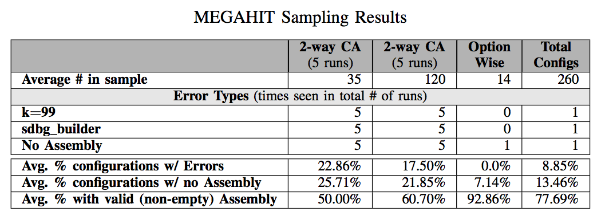

## MEGAHIT subject

We use the MEGAHIT implementaion in [KBase](https://narrative.kbase.us/#catalog/apps/MEGAHIT/run_megahit/release "KBase MEGAHIT App").  The input is the paired-end read library for the _Rhodobacter_ basterium which is file **rhodo.art.q20.PE.reads.fastq** which can be uploaded into the KBase GUI.  Our experiements could be mimiced in the GUI, however in order to increase speed we ran them using the KBase SDK inside docker.  The MEGAHIT SDK code can be found [here](https://github.com/kbaseapps/kb_megahit) and instructions to set up the KBase SDK are [here](https://github.com/kbase/kb_sdk).  In order to change the configurations options dynamically we modified the test script (./test/MegaHit_server_test.py) to fit the configuration options of our test.  The configuration options are set inline [here](https://github.com/kbaseapps/kb_megahit/blob/master/test/MegaHit_server_test.py#L116).  Then we can run the experiement with ```kb-sdk test``` and locate the results in ./test_local.

## Complete Configuration Model


## Sampling Results
We see each type of error in every sample showing that we can find the errors (and cases of failed assembly) within 35 samples instead of all 260.  Although we don't lose any of these results, we do see them in a different proportion compared to the full test.  For example in the full experiment we only saw 8.85% of the configuration leading to an explicit error, while in the 2-way CA we see about 23% and in the 3-way CA we see about 18% of the configuration leading to no assembly.  We see the same pattern with the number of configurations that failed to give an assembly.


